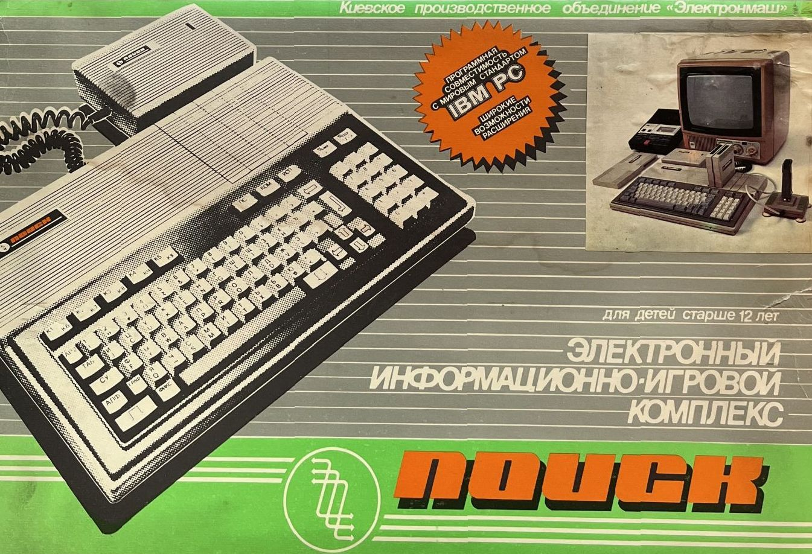
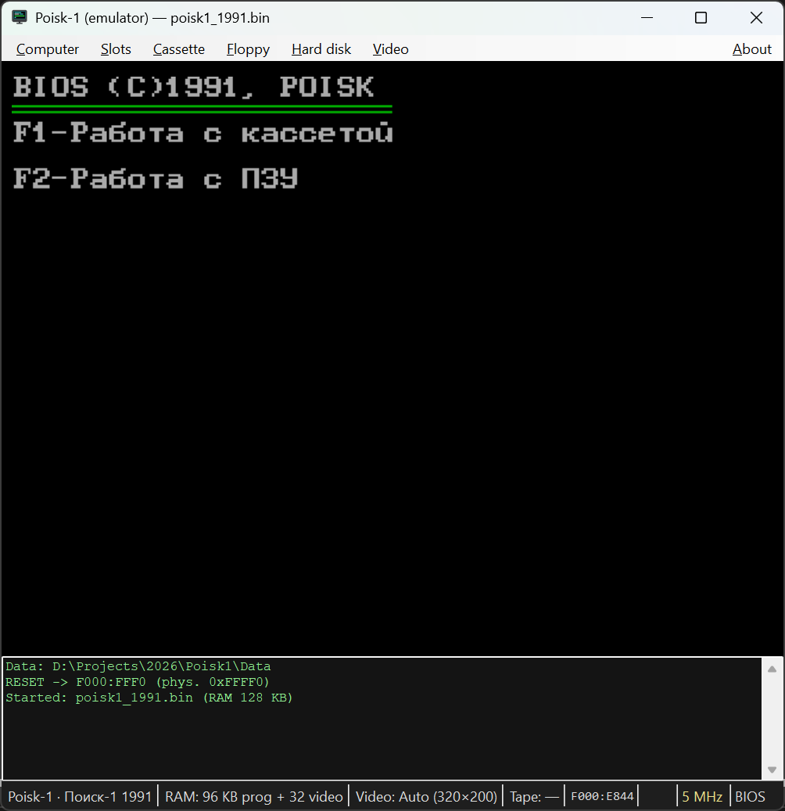

# Poisk-1 Emulator (Windows)

## A personal note

My name is Dmytro, and I am from Ukraine. The Soviet-era Poisk-1 computer was my very first computer. It was developed in Kyiv by the ELEKTRONMASH factory, which makes it not only an important piece of computing history, but also a personal part of my own story.



This emulator is my attempt to help preserve that history.

Unfortunately, many Poisk-1 computers were dismantled in the late 1990s and early 2000s for precious metals recovery. As a result, original hardware, spare parts, and documentation have become increasingly rare. Over the years I have collected several Poisk-1 machines and a large number of components, creating what my friends jokingly call a small "nature reserve" dedicated to these computers.

My connection to the Poisk-1 is deeply personal. I still remember going to the local computer market with my father and dreaming about buying a mouse adapter and a mouse itself. At the time, they were incredibly expensive, and I never managed to get one. I remember traveling across the entire city to find new 5.25-inch floppy disks filled with games and software. I remember using the BASIC editor as a notebook, storing my texts on cassette tapes, and spending countless hours exploring what this machine could do.



For many people, the Poisk-1 is just another Soviet IBM PC compatible. For me, it was the beginning of a lifelong journey into computers, programming, and technology.

This project is dedicated to preserving that experience for future generations.

---

A cycle-aware emulator of the **Poisk-1** (Поиск-1) — a Soviet IBM PC–compatible home
computer built around the КР1810ВМ88 (an Intel 8088 clone) and produced from 1989.
The emulator boots the real Poisk-1 BIOS, renders its CGA-style video, plays back cassette
tapes and floppy images, and models the original expansion cards.

> The screen you get is the genuine Poisk-1 firmware running — menus, ROM BASIC, MS-DOS
> from a virtual floppy, and cassette games all behave as they did on the real hardware.

---

## Why this exists

The Poisk-1 is a quirky, not-quite-PC machine: an 8088 core, a non-standard PIT clock
(CPU/2 instead of the IBM PC's 1.19 MHz), a custom keyboard controller, a tape interface,
and Soviet expansion cards (ROM adapter, RAM boards, the B504 floppy controller). Generic
PC emulators don't reproduce its timing or its boot quirks. This project is a faithful,
readable reimplementation written from scratch in C#, useful for:

- running original Poisk-1 software (ROM cartridges, cassette tapes, DOS floppies);
- studying how the machine actually worked (the code is heavily commented);
- preserving and testing dumps of Soviet-era firmware and disks.

---

## Features

- **8088 (КР1810ВМ88) CPU** core with full real-mode instruction set.
- **CGA-style video**: 40×25 / 80×25 text and 320×200 / 640×200 graphics, presented at a
  correct 4:3 aspect ratio.
- **Authentic timing**: PIT clocked at CPU/2, which is what makes real cassette decoding work.
- **Cassette interface**: load `.wav` (authentic, decoded like the real tape signal) or `.cas` images.
- **Expansion slots** (4), with the original cards:
  - **B003** ROM adapter — option-ROM cartridges (BASIC, games) mapped from `0xC0000`.
  - **B107 / B109** RAM expansion boards (256 KB / 512 KB), stackable.
  - **B504** floppy controller (FD1793 / КР1818ВГ93) — up to two 360/720 KB drives, boots MS-DOS.
  - **B942** hard-disk controller (WD2010) — a fixed disk from an HDD image; install MS-DOS to it with `SYS C:`.
- **Speaker audio** (square-wave), toggleable.
- **Adjustable CPU speed** (1 MHz … 100 MHz) — handy for fast-forwarding cassette loads.
- **Bilingual UI** (English / Ukrainian), with all strings externalized to JSON.

---

## Requirements

- **Windows** (the UI is WinForms).
- **.NET 10 SDK** (the projects target `net10.0` / `net10.0-windows`).
- **Poisk-1 firmware files** — see [Firmware & data files](#firmware--data-files) below. ROM
  dumps are **not** committed to the repository; you supply them in the `Data` folder.

---

## Build & run

```powershell
# from the repository root
dotnet build Poisk1.slnx

# run the GUI emulator
dotnet run --project Poisk1.WinForms
```

On first launch the emulator locates the `Data` folder, writes a default `config.json` if
none exists, loads the default BIOS, and starts running.

---

## Using the emulator

The menu bar drives everything:

| Menu | What it does |
|------|--------------|
| **Computer** | Pick a BIOS, set RAM size (128 / 512 KB), set CPU frequency, toggle speaker sound, **Reset** (Ctrl+R), **Exit**. |
| **Slots** | Plug a virtual card into one of the 4 expansion slots: ROM adapter, RAM board, or B504 floppy controller. Changing a slot restarts the machine. |
| **Cassette** | Insert a `.wav`/`.cas` tape, or eject it. |
| **Floppy** | Per drive (A, then B): connect the drive, choose a disk image, eject. |
| **Video** | Force a video mode, or leave it on Auto. |
| **About** | Language (English / Українська), author, and links. |

### Loading software

- **ROM cartridge** — put `*.bin` option-ROMs in `Data/roms/`, then **Slots → Slot N → ROM
  adapter** and pick the module (e.g. `ibasic.bin` for IBM Cassette BASIC). The BIOS scans
  the cartridge and lets you select a program.
- **Cassette tape** — **Cassette → Insert cassette…**, choose a `.wav`/`.cas` file, then on
  the Poisk press **F1**, type the program NAME, press **Enter**, then **Enter** again to
  start the "tape motor". Bump the CPU frequency up to load faster.
- **Floppy / MS-DOS** — install the **B504** controller in a slot, add a **RAM board**
  (DOS needs the extra memory), connect drive A in the **Floppy** menu, choose a `.img`
  disk image (e.g. `Data/disk/poisk720.img`), and Reset.

---

## Firmware & data files

Everything the emulator reads lives in the `Data/` folder (resolved by walking up from the
executable). ROM/disk dumps are intentionally **not** committed.

```
Data/
├── config.json            # machine configuration (auto-created)
├── poisk1_1989.bin        # system BIOS dumps (8 KB each)
├── poisk1_1991.bin
├── poisk_cga.dat          # 8×8 character generator (font)
├── langs/                 # UI translations: en.json, uk.json
├── roms/                  # ROM-adapter modules (option-ROMs, 0x55AA signature)
├── fdd/                   # B504 controller BIOS variants
├── disk/                  # floppy images (.img)
└── tapes/                 # cassette images (.wav / .cas)
```

See [`Data/README.md`](Data/README.md) for firmware details (sizes, checksums, sources).

### `config.json`

```jsonc
{
  "RamSizeKb": 128,                 // base RAM (128 = model 1.0)
  "Font": "poisk_cga.dat",          // character-generator file
  "DefaultBios": "poisk1_1991.bin", // BIOS loaded at startup
  "Bioses": [                       // entries shown in the Computer menu
    { "Name": "Поиск-1 1989", "File": "poisk1_1989.bin" },
    { "Name": "Поиск-1 1991", "File": "poisk1_1991.bin" }
  ],
  "Slots": [                        // what is plugged into each of the 4 slots
    "fdd:FDD ADD BIOS v5.00 1992 (turbo).BIN",
    "ram256", "ram256", ""
  ],
  "GlyphRemap": { "0xF6": "0x10", "0xF7": "0x11" } // font glyph remap (see Data/README.md)
}
```

---

## Tools

The `Tools/` folder holds PowerShell scripts that build the option-ROM and disk images the
emulator loads. Run them from the `Tools/` directory.

| Tool | Purpose |
|------|---------|
| **`com2rom.ps1`** | Wraps a DOS `.COM` program into a Poisk-1 **B003 option-ROM** image — a faithful port of Tronix's COM2ROM. It prepends the 512-byte `stub.bin` (a `55 AA` option-ROM that installs a dummy `int 21h`, copies the program to `1000:0100` and far-jumps to it), pads the image to 32 KB or 64 KB, and fixes the checksum so the BIOS ROM scan accepts it. This is how cassette games become ROM cartridges for `Data/roms/`. |
| **`mkfat12.ps1`** | Builds a **720 KB FAT12 floppy image** (80×2×9, 1 KB clusters) with a valid BPB from a list of 8.3-named files. The result is a DOS-readable *data* disk (not bootable) — mount it as a second drive on a booted DOS system. |
| **`mkhdd.ps1`** | Builds a partitioned **FAT16 hard-disk image** for the Poisk-1 **B942** controller (MBR + single active partition at LBA 17) and populates it with files copied out of a FAT12 floppy image (e.g. an MS-DOS 5.0 + Norton Commander disk). The image is a data disk; boot it by running `SYS C:` from a DOS floppy in A:. |
| **`stub.bin`** | The 512-byte option-ROM stub embedded by `com2rom.ps1` (not run directly). |

```powershell
# wrap a .COM into a ROM cartridge
.\com2rom.ps1 -Com "TETRIS.COM" -Out "..\Data\roms\tetris.bin"

# batch-convert a folder of .COM files into Data/roms
Get-ChildItem *.COM | .\com2rom.ps1 -OutDir "..\Data\roms"

# build a 720 KB FAT12 data floppy
.\mkfat12.ps1 -Out ..\Data\disk\basic.img -Files BAS.COM,DEMO.BAS -Label BASIC

# build a FAT16 hard-disk image from a DOS+NC floppy
.\mkhdd.ps1 -Out ..\Data\hdd_disk\dos_nc.img -From ..\Data\disk\poisk720.img -Cyl 602
```

---

## Localization

UI strings live in `Data/langs/en.json` and `uk.json` as flat `key → template` maps
(templates use `{0}`, `{1}` placeholders). English is the default; a missing key falls back
to English, then to the key itself. To add a language, drop a new `xx.json` next to the
others and register it in `Poisk1.WinForms/Lang.cs`.

---

## Project layout

| Project | Purpose |
|---------|---------|
| **Poisk1.Core** | The emulator: CPU, memory bus, I/O bus, video, devices (PIT, PIC, keyboard, cassette, speaker, FD1793, WD2010), and expansion cards. No UI dependencies. |
| **Poisk1.WinForms** | The GUI: window, menus, video rendering, audio output, keyboard mapping, localization. |

---

## Notes

- Firmware ROMs and disk images are copyrighted/proprietary and are **not** distributed with this code. Supply your own dumps in `Data/`.
- The emulator is for preservation, research, and education.
